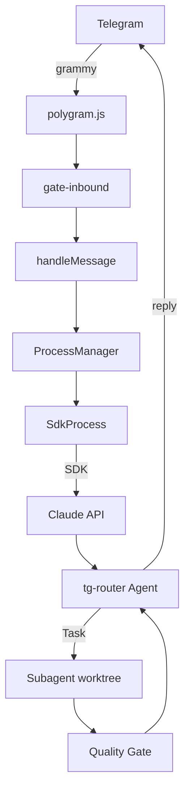

# Polygram — Claude Code as a Telegram CTO

<p align="center">
  <strong>Subagent orchestration · Karpathy's 4 Rules · Verification Loop · Auto-Merge</strong><br>
  Fork of polygram@shumkov v0.17.11 — stable, self-healing, vibe-coding accelerator
</p>

---

## What It Does

Polygram bridges Claude Code to Telegram. But this fork goes further — it turns Claude into a **CTO-level orchestrator** that spawns subagents, reviews their work, and auto-merges. You type `Done.` messages from Telegram while an army of isolated worktree subagents does the actual work.

```
TG: @bot 帮我重构 auth 模块
  ↓
tg-router agent spawns subagent (worktree isolation)
  ↓
Subagent works with internal verification loop
  ↓
Quality Gate reviews (security → correctness → quality)
  ↓
Main Agent final review → git merge → "Done."
```

## Key Features

| Feature | Description |
|---------|-------------|
| **tg-router Agent** | Custom agent: subagent-first routing, Karpathy 4 rules, verification loop, auto-skill pipeline |
| **Multi-Round Verification Loop** | Subagent self-check → Quality Gate → Main Agent gate review |
| **Quality Gate** | Senior reviewer agent (read-only, security/correctness/quality/completeness) filters before reaching main agent |
| **Research Pipeline** | AnySearch MCP → extract → subagent double-check → sourced report |
| **Auto-Review + Auto-Merge** | 90% of tasks auto-complete. Only core decisions escalate |
| **Long-Running Monitors** | Background subagents that watch deployed features and self-heal |
| **Session Briefing + Dreaming** | 30min silence → auto-briefing + insights to 5 memory backends |
| **Hot-Reload** | Config/skills reload in-process (2s). Source changes trigger graceful restart |
| **No-Edit Streaming** | Each thinking step = new message bubble, never overwrites |
| **Dynamic Command Menu** | Scans 216 skills + plugins, registers via Telegram setMyCommands |
| **Bidirectional CLI Sync** | Resume TG sessions in CLI, changes sync back automatically |
| **Approval System** | Gated tools (sudo, rm -rf, config edits) → admin DM cards |
| **Crash Recovery** | Timeout 1200s, SIGTERM grace 5s, auto-resume with stuck-process kill |

## Architecture



## Quick Start

```bash
cp config.example.json ~/polygram/config.json
# Edit config.json with your bot token and chat IDs
polygram --bot main-bot
```

**Requires:** Node ≥ 22, Claude Agent SDK, Telegram Bot API token.

## Project Docs

| File | Purpose |
|------|---------|
| `CLAUDE.md` | Rules for Claude: stack, conventions, architecture |
| `PROJECT.md` | Project resume: architecture, capability showcase, lessons learned |
| `WORKLOG.md` | Session-by-session work diary |
| `agents/tg-router.md` | Main orchestrator agent definition (533 lines) |
| `agents/quality-gate.md` | Code review gate agent (86 lines) |
| `config.example.json` | Config template with all options documented |

## License

MIT. Fork of [polygram@shumkov](https://github.com/shumkov/polygram).
